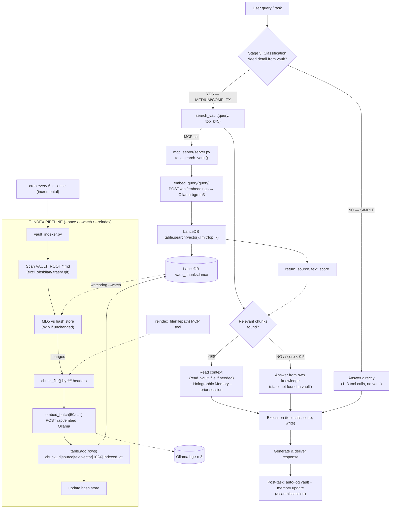

<p align="center">
  
  
  
  
  
</p>

<p align="center">
  
</p>

# Semantic Vault MCP

**Local RAG semantic search for Obsidian vaults — powered by Ollama + LanceDB + MCP.**

Search your markdown vault by **meaning** (not keyword matching). Runs fully local — zero API costs, zero data leaves your machine.

```
User query → Ollama embed → LanceDB vector search → relevant chunks → LLM context
```

## Features

- 🔍 **Semantic search** — find notes by concept, not keyword
- ⚡ **Batch embedding** — 30-50x faster than serial (50 chunks per HTTP call)
- 👁️ **Auto file watcher** — re-index files as they change (via watchdog)
- 🧩 **MCP server** — drop-in tool for Claude Desktop / Claude Code / Hermes
- 💾 **Persistent hash store** — incremental indexing, only re-index what changed
- 🔄 **Crash-safe** — circuit breaker for Ollama, batch writes to LanceDB

## Quick Start

### Prerequisites

- Python 3.10+
- [Ollama](https://ollama.com) running locally
- An Obsidian vault (or any markdown folder)

### 1. Install

```bash
# Clone
git clone https://github.com/brodewa369/roowet-semantic-vault-search.git
cd semantic-vault-mcp

# Windows
setup.bat

# Linux/Mac
chmod +x setup.sh && ./setup.sh
```

### 2. Configure

Edit `.env`:

```env
VAULT_ROOT=C:/Users/you/your-obsidian-vault
OLLAMA_BASE_URL=http://localhost:11434
EMBED_MODEL=bge-m3
```

### 3. Index your vault

```bash
python indexer/vault_indexer.py --once
```

### 4. Add MCP to Claude Desktop / Hermes

```json
{
  "mcpServers": {
    "semantic-vault": {
      "command": "python",
      "args": ["-m", "mcp_server.server"],
      "env": {
        "VAULT_ROOT": "C:/Users/you/your-vault",
        "LANCEDB_PATH": "./data/lancedb",
        "OLLAMA_BASE_URL": "http://localhost:11434",
        "EMBED_MODEL": "bge-m3"
      }
    }
  }
}
```

Restart Claude Desktop. You now have `search_vault()`, `read_vault_file()`, `vault_stats()` in your agent's toolbelt.

## Architecture

```mermaid
graph TB
    subgraph Vault["📁 Markdown Vault (VAULT_ROOT)"]
        MD[".md files<br/>01-AGENT-MEMORY/ 02-KNOWLEDGE/<br/>03-RESEARCH/ ... (excl: .obsidian .trash .git)"]
    end

    subgraph Indexer["⚙️ vault_indexer.py"]
        SCAN["Scan .md (rglob)"]
        CHUNK["Chunk by ## headers<br/>(CHUNK_SIZE=512, OVERLAP=64)"]
        HASH["MD5 hash store<br/>(incremental change detect)"]
        EMBED["OllamaEmbedder.embed_batch()<br/>/api/embed — 50 chunks/call<br/>circuit breaker (5 fails → 60s pause)"]
        LOCK["Instance lock (msvcrt)<br/>+ backup before index"]
    end

    subgraph Store["💾 LanceDB (LANCEDB_PATH)"]
        LANCE["vault_chunks.lance table<br/>chunk_id | source | text | vector[1024] | indexed_at"]
        HASHJSON["vault_indexer_hashes.json<br/>filepath → MD5"]
    end

    subgraph Ollama["🤖 Ollama (localhost:11434)"]
        MODEL["EMBED_MODEL: bge-m3<br/>(1024-dim, multilingual)"]
    end

    subgraph MCP["🔌 mcp_server/server.py (stdio JSON-RPC)"]
        TOOLS["Tools:<br/>search_vault · read_vault_file<br/>vault_stats · get_chunk<br/>reindex_file · index_stats"]
        QEMBED["embed_query()<br/>/api/embeddings"]
    end

    subgraph Client["🤖 MCP Client (Agent)"]
        AGENT["Claude / Hermes / Codex / OpenClaw<br/>SOUL.md (non-Claude) · CLAUDE.md (Claude)"]
        SKILL["/scanthissession skill<br/>(scan → write vault)"]
    end

    Vault --> SCAN
    SCAN --> CHUNK --> HASH
    CHUNK --> EMBED --> Ollama
    Ollama --> MODEL
    EMBED --> LANCE
    HASH --> HASHJSON
    LOCK -.-> Store

    Client -->|MCP tools/call| MCP
    AGENT --> SKILL
    TOOLS --> QEMBED --> Ollama
    QEMBED --> LANCE
    TOOLS -->|read_vault_file| Vault
    MCP -->|search results (chunks)| Agent
```

## Full Pipeline



## Commands

| Command | Description |
|---------|-------------|
| `python indexer/vault_indexer.py --once` | Index all vault files once |
| `python indexer/vault_indexer.py --watch` | Run as file watcher daemon |
| `python indexer/vault_indexer.py --reindex` | Clear and re-index everything |
| `python -m mcp_server.server` | Start MCP server (stdio transport) |

## MCP Tools

| Tool | Description |
|------|-------------|
| `search_vault(query, top_k=5)` | Semantic search by meaning |
| `read_vault_file(filepath)` | Read full file content |
| `vault_stats()` | Index statistics |
| `get_chunk(source)` | Get all chunks for a file |
| `reindex_file(filepath)` | Re-index a specific file |
| `index_stats()` | Hash-store statistics |

## Environment Variables

| Variable | Required | Default | Description |
|----------|----------|---------|-------------|
| `VAULT_ROOT` | ✅ | `./vault` | Path to markdown vault |
| `LANCEDB_PATH` | ✅ | `./data/lancedb` | Vector store path |
| `OLLAMA_BASE_URL` | ✅ | `http://localhost:11434` | Ollama endpoint |
| `EMBED_MODEL` | ✅ | `bge-m3` | Embedding model |
| `EMBED_DIM` | ❌ | `1024` | Embedding dimensions |
| `CHUNK_SIZE` | ❌ | `512` | Chunk size (chars) |
| `OVERLAP` | ❌ | `64` | Chunk overlap |
| `BATCH_SIZE` | ❌ | `50` | Embedding batch size |
| `EXCLUDE_DIRS` | ❌ | `.obsidian,.trash,.git` | Folders to skip |
| `MAX_BACKUPS` | ❌ | `2` | Backup retention |

## Project Structure

```
semantic-vault-mcp/
├── README.md               # Quick start + MCP config
├── CLAUDE.md              # Agent identity template — PURPOSE: Claude / Claude Code
├── AGENTS.md               # Technical MCP context + Hermes integration
├── SOUL.md                # Agent identity template — PURPOSE: agent non-Claude (Hermes/Codex/OpenClaw/OpenCode)
├── skills/                 # Agent skills
│   └── scanthissession/    # /scanthissession — scan session → write to vault
├── LICENSE                 # MIT
├── pyproject.toml        # pip install .
├── requirements.txt
├── .env.example           # All 12 env vars documented
├── .gitignore
├── setup.bat              # Windows one-click setup
├── setup.sh               # Linux/Mac one-click setup
├── indexer/
│   ├── __init__.py
│   └── vault_indexer.py    # Scan → chunk → embed → store
├── mcp_server/
│   ├── __init__.py
│   └── server.py           # MCP protocol server
├── vault-structure/         # Example vault layout
│   ├── README.md           # Folder structure explained
│   ├── obsidian-setup.md   # Recommended Obsidian plugins
│   ├── 00-NOTES/ … 08-DOCS/ # 30+ empty folders
│   ├── 06-SYSTEM/rules/    # Naming, routing, MOC creation
│   └── 06-SYSTEM/templates/ # 28 note templates
└── docs/
    └── ARCHITECTURE.md     # Data flow + design decisions
```

## Requirements

- **Ollama** with any embedding model (tested: `bge-m3`, `nomic-embed-text`)
- Python packages: `lancedb`, `pyarrow`, `requests`, `watchdog`
- ~2GB RAM for LanceDB (depends on vault size)

## Keeping Your Index Fresh

**Why regular indexing matters:**

The RAG search is only as good as your index. If you add/edit 50 files but haven't re-indexed, the search will return **stale chunks** — or miss new content entirely.

The indexer uses MD5 content hashes to detect changes, so re-indexing is fast:

```bash
# Incremental — only processes changed files (usually <1 second)
python indexer/vault_indexer.py --once
```

**Recommended cadence:**
- **Manual:** Run `--once` after any significant vault edit session
- **Cron:** Auto-index every 6 hours (the indexer is idempotent)
- **Watch mode:** `--watch` for real-time indexing (runs as daemon)

When in doubt: **re-index before every AI agent session.** A 1-second re-index can save you from getting answers based on stale vault content.

## FAQ

**Q: How long does initial indexing take?**
A: ~30-60s for 100 files with bge-m3. Batch embedding does 50 chunks per call.

**Q: Can I use other embedding models?**
A: Yes. Set `EMBED_MODEL` and `EMBED_DIM` in `.env`. Tested with `bge-m3` (1024d) and `nomic-embed-text` (768d).

**Q: Does it support incremental updates?**
A: Yes. Indexer tracks file content hashes (MD5). Re-run `--once` to only index changed files.

**Q: Can I use this without Obsidian?**
A: Yes. Any folder with `.md` files works. Set `VAULT_ROOT` to any markdown directory.

## ⚠️ Path Setup (required before use)

Files in this repo use **generic placeholders** — no hardcoded PC paths. Replace them before running:

| Placeholder | Meaning | Example (Windows) | Example (Linux/Mac) |
|---|---|---|---|
| `<VAULT_ROOT>` | Path to your markdown vault | `C:/Users/you/vault` | `~/vault` |
| `<HERMES_SCRIPTS>` | Path to Hermes scripts | `AppData/Local/hermes/scripts` | `~/.hermes/scripts` |

In `skills/scanthissession/SKILL.md`: replace `<VAULT_ROOT>` (line ~48) and `<HERMES_SCRIPTS>` (line ~52) with your environment paths.
`SOUL.md` / `CLAUDE.md` are generic templates — set `VAULT_ROOT` in `.env` (see `AGENTS.md`) so `search_vault()` works.

**Different purpose:** `SOUL.md` = non-Claude agents (Hermes/Codex/OpenClaw/OpenCode). `CLAUDE.md` = Claude/Claude Code. Content is the SAME.

## Skills

### `/scanthissession` — Session Scanner & Vault Writer

The agent scans the session transcript, detects vault-relevant items (errors, decisions, corrections, lessons, etc.), then **automatically writes them to the correct vault folder**. This solves agents "forgetting" to log — the skill FORCES scan + write, instead of relying on passive instructions.

```bash
/scanthissession
# or say: "scan session", "log session ini"
```

**When:** after a long session (>10 tool calls), before ending a session.
**Output:** files written to `<VAULT_ROOT>/01-AGENT-MEMORY/...` + daily-note updated.

## License

MIT
